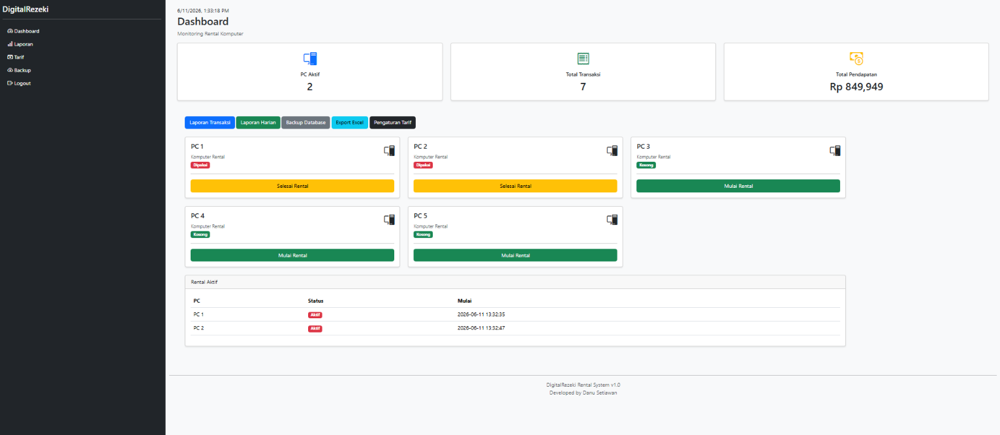

# Computer Rental Management System

A web-based rental management application developed using Python Flask.

## Overview

This system helps rental businesses manage computer usage, rental transactions, billing, and revenue reporting through a centralized dashboard.

## Features

### Rental Operations

* Start Rental
* Stop Rental
* Real-Time PC Monitoring
* Rental Duration Tracking

### Financial Management

* Automated Billing
* Revenue Dashboard
* Daily Transaction Report
* Tariff Configuration

### System Utilities

* Database Backup
* Excel Export
* Transaction History

## Technology Stack

* Python
* Flask
* SQLite
* Bootstrap
* HTML
* CSS
* JavaScript

## Screenshots

### Dashboard

## Developer

Danu Setiawan
